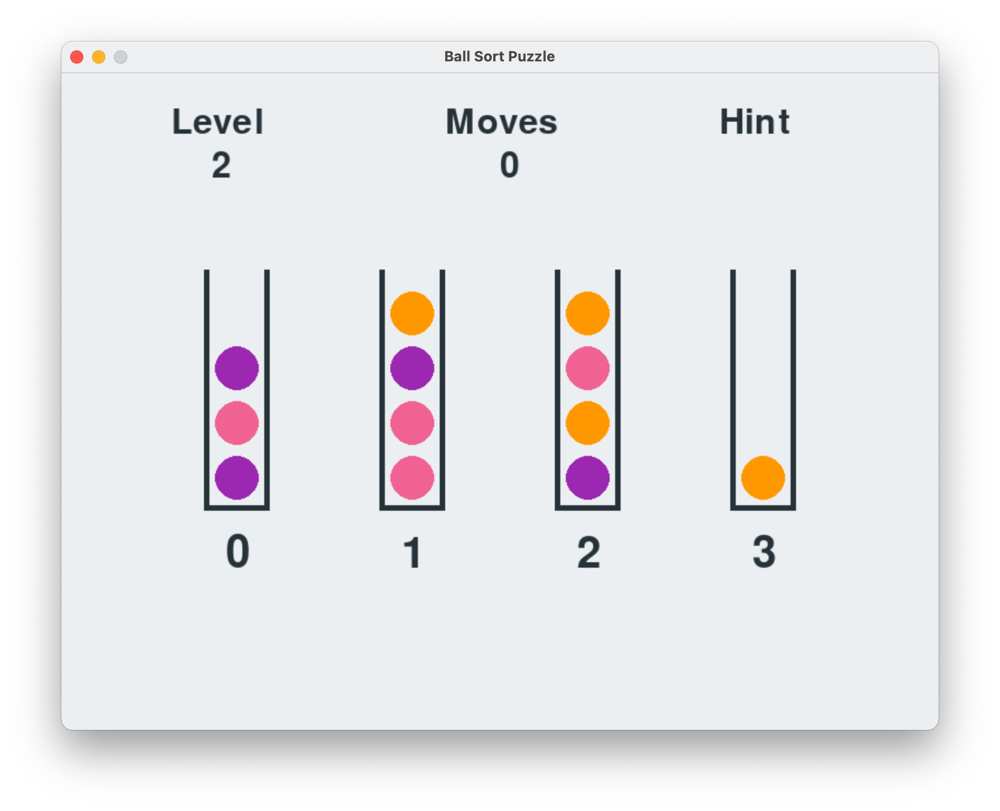
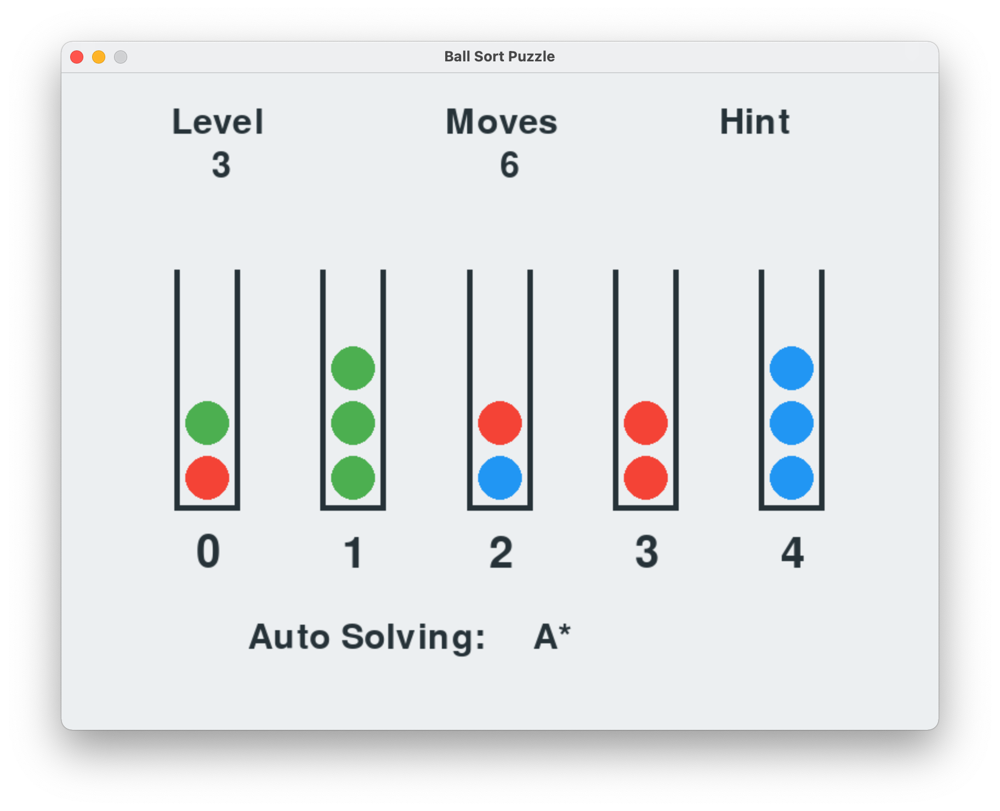
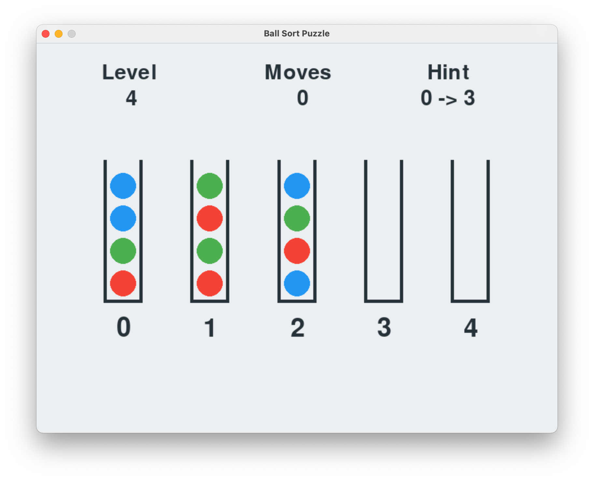
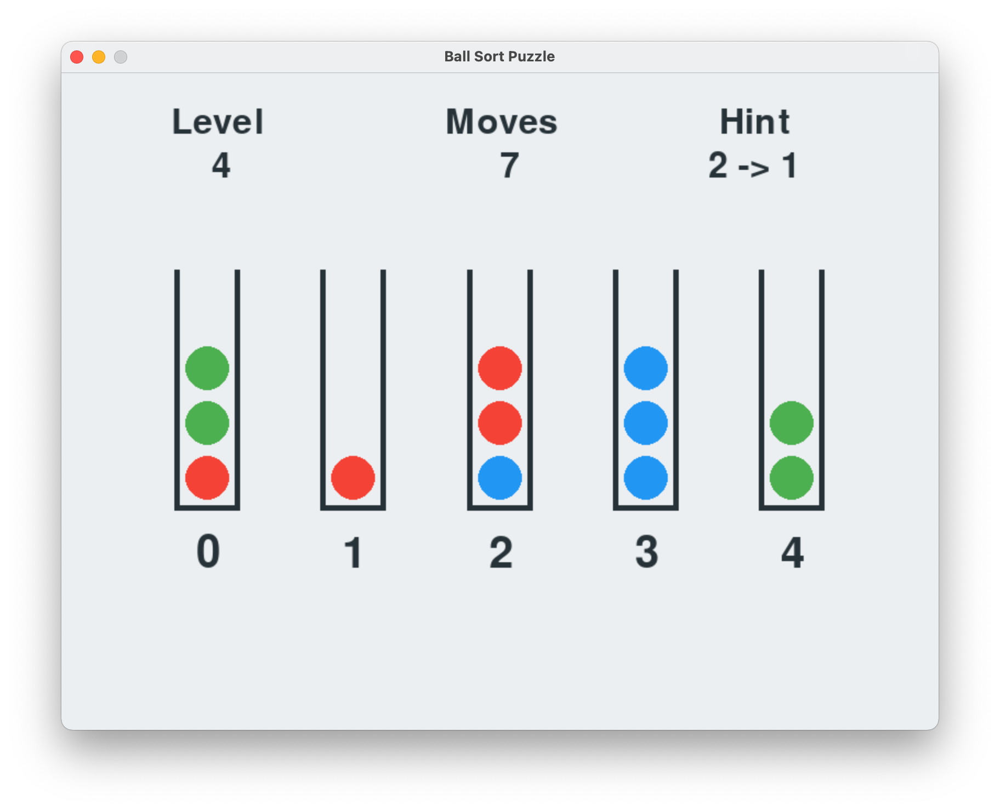

# Ball Sort Game Solver

This is an implementation of the puzzle game Ball Sort, the implementation has 8 example levels but more can be added in the files and it has features such as: Hints, Solver with multiple Algorithms and a Auto Solver.
## Screenshots

| | |
|:-------------------------:|:-------------------------:|
|  |   |
|   |  |  

## Usage Instruction
### First setup
- Run `pip install pygame`
### Run the program
- Run `python ballSort.py`
### How to Play
In order to move a ball you need to click on the tube where you want the ball to be removed from , and then click the second tube where you want to put the previously remove ball
### In Game Keyboard commands
- **D** - Skip Level
- **H** - Ask for hint
- **S** - Solve with every algorithm . Displays on console All the algotithms information for that level .
- **Auto Solve commands**
  - **A** or **1** - Auto solve (default : A*)
  - **2** - Greedy Search
  - **3** - Depth First Search
  - **4** - Breadth First Search
  - **5** - Uniform Cost
  - **6** - Iterative Deepening (5)
  - **7** - Limited Depth (30) 

#### Error messages
- **No Solutions** - This message is displayed whenever the search algorithm could not find a solution for that level
